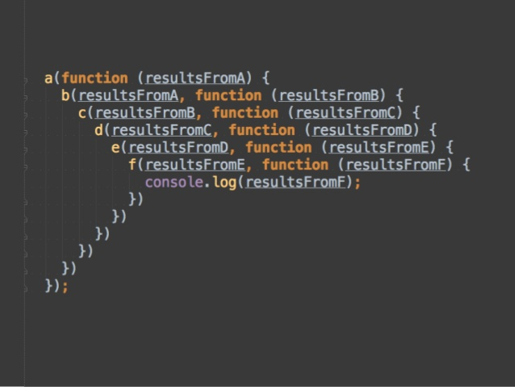
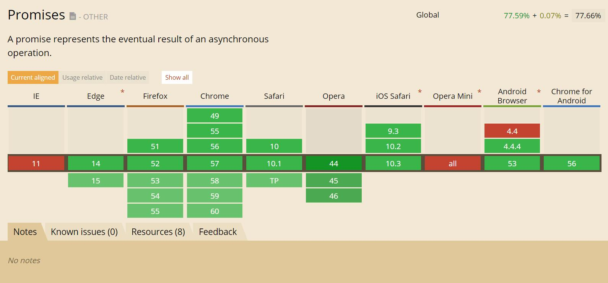

# Promise? <br>Promise.

<!-- page -->

> ['prɒmɪs]

> n. 许诺，允诺；希望

<!-- page -->

> The Promise object is used for asynchronous computations.

> A Promise represents a value which may be available now, or in the future, or never.

> --[MDN](https://developer.mozilla.org/en-US/docs/Web/JavaScript/Reference/Global_Objects/Promise)

<!-- section -->

> Promise 对象用于异步计算。

> 一个 Promise 表示一个现在、将来或永不可能可用的值。

<!-- fragment -->


<!-- page -->

Promise 对象

* 用于异步计算。
* 它代表一个值，
* 这个值可能现在就可以用；
* 也可能将来才可以用（正在加载）;
* 甚至永远不会存在（但不耽误我们写别的）。

<!-- page -->

## 为什么会有 Promise？

1. JavaScript 为检查表单而生
2. 接下来它可以操作 DOM
3. JS 的操作大多是异步的
4. 无阻塞成为 JS 的特色

Note:
3. (作为一门 UI 语言，界面冻结是大忌)

<!-- section -->

稍有不慎，就会踏入“回调地狱”。



<!-- page -->

假设需求：

遍历目录，找出包含关键词的文件，将其中包含关键词的一行取出来，放在另一个文件里，并返回所有文件的文件名。

<!-- section -->
```javascript
function findLargest(dir, callback) {
  fs.readdir(dir, function (err, files) {
    if (err) return callback(err);
    let errored = false;
    let stats = [];
    files.forEach( file => {
      fs.stat(path.join(dir, file), (err, stat) => { // [1]
        if (errored) return; // [2]
        if (err) {
          errored = true;
          return callback(err);
        }
        stats.push(stat); // [3]
      });
    });
    let largest = stats
      .filter(function (stat) { return stat.isFile(); })
      .reduce(function (prev, next) {
        if (prev.size > next.size) return prev;
        return next;
      });
    callback(null, files[stats.indexOf(largest)]);
  })
}

findLargest('./path/to/dir', function (err, filename) {
  if (err) return console.error(err);
  console.log('largest file was:', filename);
});
```

<!-- page -->

回调有三个问题：

1. 嵌套层次很深，难以维护
2. 无法正常使用 `return` 和 `throw`
3. 无法正常检索堆栈信息

<!-- page -->

社区经过长时间探索，最终总结出：

## Promise

1. 可以很好的解决回调嵌套问题
2. 代码阅读体验很好
3. 不需要增加新的语法

<!-- page -->

## Promise 详解

<!-- section -->

```javascript
new Promise(
  function (resolve, reject) {
    // 一段耗时很长的异步操作
    // 数据处理完成
    resolve();

    // 数据处理出错
    reject();
  }
)
  .then( function () {
    // 成功，下一步
  }, function () {
    // 失败，做相应处理
  });
```

Note:
正所谓“我不入地狱谁入地狱”，Promise 使用回调解决了回调……

<!-- section -->

1. Promise 是一个 **代理对象**，它和原先的操作并无关系。
2. Promise 有3个状态：
    1. `pending` [待定] 初始状态
    2. `fulfilled` [实现] 操作成功
    3. `rejected` [被否决] 操作失败
3. Promise 一经创建，立即执行。
4. Promise 状态发生改变的时候，就会执行 `.then()` 里的回调。
5. Promise 的状态一经改变，不会再变。

<!-- section -->

接下来，看一个简单的范例

### 定时执行

<!-- ./sample/timeout.js -->

<!-- page -->

再看一个两步执行完的范例

### 两次定时执行

<!-- ./sample/timeout2.js -->

<!-- page -->

假如在 `.then()` 的函数里面不返回新的 Promise，会怎样？

<!-- ./sample/timeout3.js -->

<!-- page -->

## `.then()`

1. `.then()`接受一个或两个函数作为参数
2. 当前面的 Promise 状态改变时，根据最终状态，选择执行
3. `fulfilled` 函数可以返回新的 Promise，或其它值
4. 如果返回新的 Promise，那么下一级 `.then()` 会在其完成之后执行
5. 如果返回其它任何值，则会继续执行下一级 `.then()`

Note:
1. (我建议只传一个，错误处理用 `.catch()`)

<!-- page -->

问题：下面的四种 promises 的区别是什么

```javascript
// #1
doSomething().then(function () {
  return doSomethingElse();
});

// #2
doSomething().then(function () {
  doSomethingElse();
});

// #3
doSomething().then(doSomethingElse());

// #4
doSomething().then(doSomethingElse);
```

<!-- page -->

```javascript
doSomething()
  .then(function () {
    return doSomethingElse();
  });
```

答案：

```
doSomething
|-----------|
            doSomethingElse(undefined)
            |------------|
                         finalHandler(resultOfDoSomethingElse)
                         |------------|
```

<!-- section -->

```javascript
doSomething()
  .then(function () {
    doSomethingElse();
  })
  .then(finalHandler);
```

答案：

```
doSomething
|-----------------|
                  doSomethingElse(undefined)
                  |------------------|
                  finalHandler(undefined)
                  |------------------|
```

<!-- section -->
```javascript
doSomething()
  .then(doSomethingElse())
  .then(finalHandler);
```

答案：

```
doSomething
|-----------------|
doSomethingElse(undefined)
|---------------------------------|
                  finalHandler(resultOfDoSomething)
                  |------------------|
```

<!-- section -->

```javascript
doSomething()
  .then(doSomethingElse)
  .then(finalHandler);
```

答案：

```
doSomething
|-----------|
            doSomethingElse(resultOfDoSomething)
            |------------|
                         finalHandler(resultOfDoSomethingElse)
                         |------------------|
```

<!-- section -->

注：以上4道题及答案均来自 [We have a problem with promises](https://pouchdb.com/2015/05/18/we-have-a-problem-with-promises.html)

<!-- page -->

## 错误处理

<!-- ./sample/error.js -->
<!-- ./sample/error-reject.js -->

<!-- section -->

Promise 会自动捕获内部异常，并交给 `reject` 函数处理。

我们通常有两种做法：

1. `reject('错误信息')`<br>`.then(null, message => {})`
2. `throw new Error('错误信息')`<br>`.catch( message => {})`

我推荐使用第二种，更加清晰，更加好读，并且可以捕获前面的错误。

<!-- section -->

<i class="fa fa-warning"></i> 注意：强烈建议在所有队列最后都加上 `.catch()`，以避免漏掉错误处理造成意想不到的问题。

<!-- section -->

### `.catch()` 与 `.then()` 混用

<!-- page -->

## 把回调包装成 Promise

<!-- page -->

## `forEach`

<!-- section -->

### 进阶：使用 Generator 遍历 

<!-- page -->

## `Promise.all()`

<!-- page -->

## 实现队列

<!-- page -->

## `Promise.resolve()`

<!-- section -->

## `Promise.reject()`

<!-- page -->

## `Promise.race()`

<!-- page -->

## jQuery

jQuery 已经实现了 Promise。参见 [jqXHR](http://api.jquery.com/jQuery.ajax/#jqXHR)

```javascript
$.ajax(url, {
  dataType: 'json'
})
  .then(json => {
    // 该干啥干啥
  });
```

<!-- section -->

### jQuery.defered

<!-- page -->

我们来用 Promise 改造一下前面的例子。

<!-- section -->

```javascript
function search(dir, keyword, callback) {
  return new Promise( resolve => {
    fs.readdir(dir, function (err, files) {
      if (err) throw err;
      resolve(files);
    })
  })
    .then( files => {
      return Promise.all( files.map( file => {
        return new Promise(resolve => {
          fs.stat(path.join(dir, file), function (err, stat) {
            if (err) throw err;
            if (stat.isDirectory()) {
              throw new Error('Not File');
            }
            resolve(stat);
          });
        })
          .then( stat => {
            return new Promise(resolve => {
              fs.readFile(path.join(dir, file), 'utf8', function (err, content) {
                if (err) throw err;
                if (content.indexOf(keyword) === -1) {
                  throw new Error('No keyword');
                }
                resolve(content);
              });
            });
          })
          .catch( err => {
            if (err.message === 'Not File') {
              return;
            }
            throw err;
          })
          .then( content => {
            return new Promise(resolve => {
              var lines = content.match(/.*keyword.*/g);
              fs.writeFile(path.join(dir, file + '.result'),
                          lines.join('\s'), 'utf8', function (err) { // [5]
                if (err) throw err;
                resolve(file);
              });
            });
          })
          .catch( err => {
            if (err.message === 'No keyword') {
              return;
            }
            throw err;
          });
        });
      });
    });
}

search('some/path/', 'meathill')
  .then( files => {
    console.log(files);
  })
  .catch( err => {
    console.log(err);
  });
```

<!-- page -->

## Promise 的支持情况



放手用吧，少年！

<!-- page -->

## Q&A

<!-- page -->

#### 参考：

* [MDN](https://developer.mozilla.org/en-US/docs/Web/JavaScript/Reference/Global_Objects/Promise)
* [MDN 中文](https://developer.mozilla.org/zh-CN/docs/Web/JavaScript/Reference/Global_Objects/Promise)
* [阮一峰：ECMAScript 6 入门 - Promise 对象](http://es6.ruanyifeng.com/#docs/promise)
* [[翻译] We have a problem with promises](http://fex.baidu.com/blog/2015/07/we-have-a-problem-with-promises/)